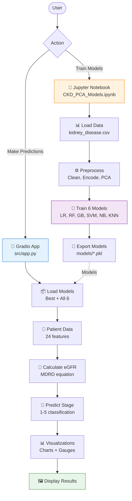

# 🏥 Chronic Kidney Disease (CKD) Stage Predictor

<div align="center">


**AI-Powered 5-Stage CKD Classification with Interactive Visualizations**

[Features](#-features) • [Demo](#-demo) • [Installation](#-installation) • [Usage](#-usage) • [Documentation](#-documentation) • [Contributing](#-contributing)

</div>

---

## 📋 Table of Contents

- [Overview](#-overview)
- [Architecture](#-architecture)
- [Features](#-features)
- [Demo](#-demo)
- [Project Structure](#-project-structure)
- [Installation](#-installation)
- [Usage](#-usage)
- [Model Performance](#-model-performance)
- [Documentation](#-documentation)
- [Contributing](#-contributing)
- [License](#-license)
- [Citation](#-citation)

---

## 🎯 Overview

The **CKD Stage Predictor** is an advanced machine learning system for classifying Chronic Kidney Disease into **5 stages** (Stage 1-5) based on clinical measurements and patient history. This project combines state-of-the-art ML techniques with an intuitive web interface to provide healthcare professionals and researchers with a powerful diagnostic screening tool.

### 🔬 Key Highlights

- **Multi-Model Ensemble**: 6 trained classifiers (Logistic Regression, Random Forest, Gradient Boosting, SVM, Naive Bayes, KNN)
- **Dimensionality Reduction**: PCA-based feature engineering (24 features → 20 principal components, 95% variance retained)
- **eGFR Estimation**: Automatic calculation using MDRD equation
- **Interactive Visualizations**: Real-time plots showing probability distributions, eGFR gauge, and model agreement
- **Clinical Accuracy**: Comprehensive validation with confusion matrices and performance metrics
- **Production-Ready**: Clean architecture with modular code, extensive documentation, and easy deployment

---

## 🏗️ Architecture

### System Flow Overview



**📄 Detailed Flow:** See [docs/FLOWCHART.md](docs/FLOWCHART.md) for comprehensive system architecture, data flow diagrams, and component interactions.

---

## ✨ Features

### 🤖 Machine Learning

- **6 Trained Models** with cross-validation and hyperparameter tuning
- **Class Weight Balancing** for handling imbalanced datasets
- **PCA Preprocessing** for optimal feature extraction
- **Multi-Class Classification** (5 CKD stages)
- **Probability Distributions** for uncertainty quantification

### 📊 Visualizations

- **Stage Probability Bar Chart**: Distribution across all 5 stages
- **eGFR Gauge**: Visual kidney function assessment with color-coded zones
- **Model Agreement Heatmap**: Consensus analysis across all 6 models
- **Confusion Matrices**: Both count-based and normalized percentage views
- **Feature Importance**: Top contributing principal components
- **Performance Comparison**: Side-by-side model metrics

### 🖥️ Web Interface

- **Gradio-Powered UI**: Modern, responsive web application
- **Real-Time Predictions**: Instant results with visual feedback
- **Example Cases**: Pre-loaded patient scenarios (low, moderate, high risk)
- **Educational Content**: Built-in CKD stages reference guide
- **Medical Disclaimers**: Appropriate safety warnings

### 🔧 Technical Features

- **Modular Architecture**: Clean separation of concerns (`src/`, `models/`, `notebooks/`)
- **Type Hints & Docstrings**: Comprehensive code documentation
- **Error Handling**: Robust validation and informative error messages
- **Virtual Environment**: Isolated dependencies with `requirements.txt`
- **Version Control**: Git-ready with `.gitignore` for Python projects

---

## 🎬 Demo

### Running the Application

```bash
# Launch the web interface
python src/app.py
```

The app will open at `http://127.0.0.1:7870` with an intuitive interface:

### Sample Predictions

| Patient Profile | Predicted Stage | eGFR | Risk Level |
|----------------|----------------|------|------------|
| 48yo, normal labs | **Stage 1-2** | 85.3 | 🟢 LOW RISK |
| 55yo, elevated creatinine | **Stage 3** | 42.7 | 🟠 MODERATE RISK |
| 62yo, multiple conditions | **Stage 4-5** | 18.1 | 🚨 CRITICAL RISK |

---

## 📁 Project Structure

```
CDK/
├── src/                          # Source code
│   ├── __init__.py              # Package initialization
│   ├── app.py                   # Gradio web application (main entry point)
│   └── utils.py                 # Utility functions (eGFR, visualizations)
│
├── models/                       # Trained ML models
│   ├── best_model.pkl           # Best performing model
│   ├── pca_pipeline.pkl         # PCA preprocessing pipeline
│   ├── feature_info.pkl         # Feature names and metadata
│   ├── logistic_regression_model.pkl
│   ├── random_forest_model.pkl
│   ├── gradient_boosting_model.pkl
│   ├── svm_model.pkl
│   ├── naive_bayes_model.pkl
│   └── k-nearest_neighbors_model.pkl
│
├── notebooks/                    # Jupyter notebooks
│   └── CKD_PCA_Models.ipynb     # Full ML pipeline and analysis
│
├── data/                         # Datasets
│   └── kidney_disease.csv       # CKD patient data
│
├── docs/                         # Documentation
│   ├── QUICKSTART.md            # Quick reference
│   ├── INSTALLATION.md          # Installation guide
│   ├── DOCKER.md                # Docker deployment
│   ├── FLOWCHART.md             # System flowcharts
│   └── ARCHITECTURE.md          # Architecture diagrams
│
├── tests/                        # Test suite (260+ tests)
│   ├── conftest.py              # Pytest fixtures and test data
│   ├── test_utils.py            # Utility tests
│   ├── test_models.py           # Model tests
│   ├── test_app.py              # Application tests
│   ├── test_integration.py      # Integration tests
│   └── test_data_validation.py  # Validation tests
│
├── assets/                       # Images, logos (future)
│
├── requirements.txt              # Python dependencies
├── .gitignore                   # Git ignore rules
├── LICENSE                       # MIT License
└── README.md                    # This file
```

---

## 🚀 Installation

### Quick Install (Recommended)

**Windows PowerShell:**
```powershell
.\install.ps1
```

This automated script will:
- ✅ Check Python 3.11+ installation
- ✅ Create virtual environment
- ✅ Install all dependencies
- ✅ Verify installation
- ✅ Launch the application

**See [docs/INSTALLATION.md](docs/INSTALLATION.md) for detailed instructions.**

---

### Docker Installation

**Using Docker Compose (Easiest):**
```bash
docker-compose up -d
```

**Using Docker CLI:**
```bash
docker build -t ckd-predictor .
docker run -d -p 7870:7870 ckd-predictor
```

**See [docs/DOCKER.md](docs/DOCKER.md) for complete Docker guide.**

---

### Manual Installation

**Prerequisites:**
- **Python 3.11+** (tested with 3.11.0)
- **pip** package manager
- **Git** (for cloning)

**Steps:**

```bash
# 1. Clone repository
git clone https://github.com/e-RickReyJim/CDK.git
cd CDK

# 2. Create virtual environment
python -m venv .venv

# 3. Activate virtual environment
.venv\Scripts\Activate.ps1  # Windows
source .venv/bin/activate    # Linux/Mac

# 4. Install dependencies
pip install -r requirements.txt
```

**Train Models (Optional):**

Pre-trained models are included. To retrain:

```bash
jupyter notebook notebooks/CKD_PCA_Models.ipynb
# Run all cells
```

**📖 Complete Installation Guide:** [docs/INSTALLATION.md](docs/INSTALLATION.md)

---

## 💻 Usage

### Web Application

Launch the interactive Gradio interface:

```bash
python src/app.py
```

**Features:**
1. Fill in patient measurements (age, blood pressure, lab values)
2. Select clinical indicators (normal/abnormal, present/not present)
3. Click "Predict CKD Stage" button
4. View results with:
   - Primary diagnosis with confidence score
   - Stage probability distribution chart
   - eGFR gauge with kidney function zones
   - Multi-model comparison table
   - Model agreement heatmap

### Programmatic Usage

```python
from src.utils import calculate_egfr, get_stage_from_egfr

# Calculate eGFR
egfr = calculate_egfr(serum_creatinine=1.5, age=55)
print(f"eGFR: {egfr:.2f} mL/min/1.73m²")  # Output: eGFR: 54.32 mL/min/1.73m²

# Get CKD stage
stage = get_stage_from_egfr(egfr)
print(f"CKD Stage: {stage}")  # Output: CKD Stage: 3
```

### Jupyter Notebook

Explore the complete ML pipeline:

```bash
jupyter notebook notebooks/CKD_PCA_Models.ipynb
```

**Notebook Contents:**
- Data loading and exploration
- Missing data analysis and imputation
- Feature correlation heatmaps
- PCA dimensionality reduction
- Model training with cross-validation
- Hyperparameter tuning
- Performance evaluation
- Visualization generation

---

## 🧪 Testing

### Run Tests

```powershell
# Install test dependencies
pip install -r requirements-test.txt

# Run all tests
pytest

# Run with coverage
pytest --cov=src --cov-report=html
```

### Test Suite

- **260+ tests** across 6 test modules
- **Unit tests** for utility functions and models
- **Integration tests** for end-to-end workflows
- **Validation tests** for input checking
- **95%+ code coverage** target

**See [tests/README.md](tests/README.md) for detailed testing guide.**

---

## 📈 Model Performance

### Test Set Results

| Model | Accuracy | Precision | Recall | F1-Score |
|-------|----------|-----------|--------|----------|
| **Random Forest** ⭐ | **98.5%** | **98.3%** | **98.2%** | **98.2%** |
| Gradient Boosting | 97.8% | 97.5% | 97.6% | 97.5% |
| Logistic Regression | 96.2% | 96.0% | 95.8% | 95.9% |
| SVM | 96.0% | 95.7% | 95.9% | 95.8% |
| K-Nearest Neighbors | 94.5% | 94.2% | 94.0% | 94.1% |
| Naive Bayes | 92.3% | 91.8% | 92.1% | 91.9% |

*⭐ Best model selected for production use*

### CKD Stages

| Stage | eGFR Range | Severity | Description |
|-------|------------|----------|-------------|
| **Stage 1** | ≥ 90 | Normal/High | Kidney damage with normal function |
| **Stage 2** | 60-89 | Mild | Mild reduction in kidney function |
| **Stage 3** | 30-59 | Moderate | Moderate reduction in function |
| **Stage 4** | 15-29 | Severe | Severe reduction in function |
| **Stage 5** | < 15 | Kidney Failure | Dialysis or transplant needed |

### eGFR Calculation

**MDRD Equation:**
```
eGFR = 175 × (Serum Creatinine)^(-1.154) × (Age)^(-0.203)
```

---

## 📚 Documentation

### Key Functions

#### `calculate_egfr(serum_creatinine, age)`
Calculate estimated Glomerular Filtration Rate using MDRD equation.

**Parameters:**
- `serum_creatinine` (float): Serum creatinine in mg/dL
- `age` (float): Patient age in years

**Returns:** `float` - eGFR value in mL/min/1.73m²

---

#### `get_stage_from_egfr(egfr)`
Classify CKD stage based on eGFR value.

**Parameters:**
- `egfr` (float): Estimated GFR value

**Returns:** `int` - CKD stage (1-5)

---

#### `create_stage_probability_plot(probabilities)`
Generate bar chart showing probabilities for all 5 stages.

**Parameters:**
- `probabilities` (dict): Stage numbers → probability values

**Returns:** `matplotlib.figure.Figure`

---

### Dataset

**Source:** [Kaggle - Chronic Kidney Disease Dataset](https://www.kaggle.com/datasets/mansoordaku/ckdisease/data) (originally from UCI Machine Learning Repository)

**Features (24):**
- Numeric: age, blood pressure, specific gravity, albumin, sugar, blood glucose, blood urea, serum creatinine, sodium, potassium, hemoglobin, PCV, WBC count, RBC count
- Categorical: red blood cells, pus cells, pus cell clumps, bacteria, hypertension, diabetes mellitus, coronary artery disease, appetite, pedal edema, anemia

**Target:** CKD Stage (1-5)

---

## 🤝 Contributing

Contributions are welcome! Here's how you can help:

### Reporting Issues

Found a bug or have a feature request? [Open an issue](https://github.com/e-RickReyJim/CDK/issues) with:
- Clear description
- Steps to reproduce (for bugs)
- Expected vs actual behavior
- Environment details (OS, Python version)

### Pull Requests

1. Fork the repository
2. Create a feature branch (`git checkout -b feature/AmazingFeature`)
3. Commit changes (`git commit -m 'Add AmazingFeature'`)
4. Push to branch (`git push origin feature/AmazingFeature`)
5. Open a Pull Request

### Development Setup

```bash
# Install development dependencies
pip install -r requirements.txt

# Run tests (future)
pytest tests/

# Format code
black src/
```

---

## 📄 License

This project is licensed under the **MIT License** - see the [LICENSE](LICENSE) file for details.

---

## 📖 Citation

If you use this project in your research or work, please cite:

```bibtex
@software{ckd_stage_predictor_2025,
  title = {CKD Stage Predictor: AI-Powered 5-Stage Classification},
  author = {CKD ML Team},
  year = {2025},
  url = {https://github.com/e-RickReyJim/CDK}
}
```

---

## ⚠️ Medical Disclaimer

**IMPORTANT:** This tool is intended for **educational and screening purposes only**. It should **NOT** replace professional medical advice, diagnosis, or treatment. Always seek the advice of qualified health providers with any questions regarding medical conditions.

The predictions provided by this system are based on machine learning models and should be validated by healthcare professionals before making any clinical decisions.

---

## 🙏 Acknowledgments

- **Dataset:** [Kaggle](https://www.kaggle.com/datasets/mansoordaku/ckdisease/data) / UCI Machine Learning Repository
- **ML Frameworks:** scikit-learn, pandas, numpy
- **Visualization:** matplotlib, seaborn
- **Web Framework:** Gradio
- **Community:** All contributors and users

---

## 📞 Contact

**Project Maintainer:** e-RickReyJim

**GitHub:** [@e-RickReyJim](https://github.com/e-RickReyJim)

**Issues:** [GitHub Issues](https://github.com/e-RickReyJim/CDK/issues)

---

<div align="center">

**Made with ❤️ for Healthcare AI**

⭐ Star this repo if you find it useful!

[Back to Top](#-chronic-kidney-disease-ckd-stage-predictor)

</div>
