# CKD Stage Predictor - Solution Architecture & Flow

## 🔄 Complete System Flowchart

```mermaid
flowchart TB
    Start([👤 User/Developer]) --> Choice{Choose Path}
    
    %% Model Training Path
    Choice -->|Training Path| DataLoad[📊 Load Dataset<br/>kidney_disease.csv]
    DataLoad --> EDA[🔍 Exploratory Data Analysis<br/>Missing data, correlations]
    EDA --> Preprocess[🧹 Data Preprocessing<br/>Handle missing values<br/>Encode categoricals]
    Preprocess --> Stage[📐 Calculate CKD Stages<br/>eGFR = 175 × SC^-1.154 × Age^-0.203]
    Stage --> Split[✂️ Train/Val/Test Split<br/>70% / 15% / 15%<br/>Stratified by stage]
    Split --> PCA[🎯 PCA Transformation<br/>24 features → 20 PCs<br/>95% variance retained]
    PCA --> Train[🤖 Train 6 Models<br/>• Logistic Regression<br/>• Random Forest<br/>• Gradient Boosting<br/>• SVM<br/>• Naive Bayes<br/>• KNN]
    Train --> Evaluate[📈 Model Evaluation<br/>Cross-validation<br/>Confusion matrices<br/>Performance metrics]
    Evaluate --> Select[⭐ Select Best Model<br/>Random Forest: 98.5% acc]
    Select --> SaveModels[💾 Save Models<br/>models/*.pkl]
    SaveModels --> Ready[✅ Models Ready]
    
    %% Prediction Path
    Choice -->|Prediction Path| AppStart[🚀 Launch Gradio App<br/>python src/app.py]
    AppStart --> LoadModels[📦 Load Trained Models<br/>• PCA pipeline<br/>• Best model<br/>• All 6 models<br/>• Feature info]
    LoadModels --> Interface[🖥️ Web Interface Ready<br/>http://127.0.0.1:7870]
    Interface --> Input[📝 User Input<br/>24 clinical features]
    Input --> Validate[✓ Input Validation<br/>Check ranges<br/>Handle missing]
    Validate --> CalcEGFR[🧮 Calculate eGFR<br/>MDRD equation]
    CalcEGFR --> Transform[🔄 PCA Transform<br/>24 → 20 features]
    Transform --> Predict[🎯 Predictions<br/>• Best model<br/>• All 6 models<br/>• Probabilities]
    Predict --> Visualize[📊 Generate Visualizations<br/>• Probability chart<br/>• eGFR gauge<br/>• Model agreement<br/>• Comparison table]
    Visualize --> Display[🖼️ Display Results<br/>Stage, confidence,<br/>risk assessment]
    Display --> UserDecision{User Action?}
    UserDecision -->|New Patient| Input
    UserDecision -->|View Details| Visualize
    UserDecision -->|Exit| End([End])
    
    Ready -.->|Models Available| LoadModels
    
    %% Styling
    classDef training fill:#e3f2fd,stroke:#1976d2,stroke-width:2px
    classDef prediction fill:#f3e5f5,stroke:#7b1fa2,stroke-width:2px
    classDef ml fill:#fff3e0,stroke:#f57c00,stroke-width:2px
    classDef viz fill:#e8f5e9,stroke:#388e3c,stroke-width:2px
    classDef io fill:#fce4ec,stroke:#c2185b,stroke-width:2px
    
    class DataLoad,EDA,Preprocess,Stage,Split training
    class AppStart,Interface,Input,Display io
    class PCA,Train,Evaluate,Select,Transform,Predict ml
    class Visualize,UserDecision viz
    class LoadModels,SaveModels prediction
```

## 📋 Detailed Component Flow

### 1️⃣ **Model Training Pipeline** (Jupyter Notebook)

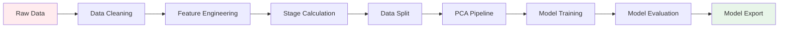

**Steps:**
1. Load `kidney_disease.csv` (400 patients, 26 features)
2. Handle missing values (imputation, dropping)
3. Encode categorical variables (binary encoding)
4. Calculate eGFR using MDRD equation
5. Classify into 5 stages based on eGFR
6. Split data (70/15/15) with stratification
7. Apply PCA (reduce to 20 components)
8. Train 6 different classifiers
9. Evaluate with cross-validation
10. Export models to `models/` directory

---

### 2️⃣ **Prediction Pipeline** (Gradio Application)

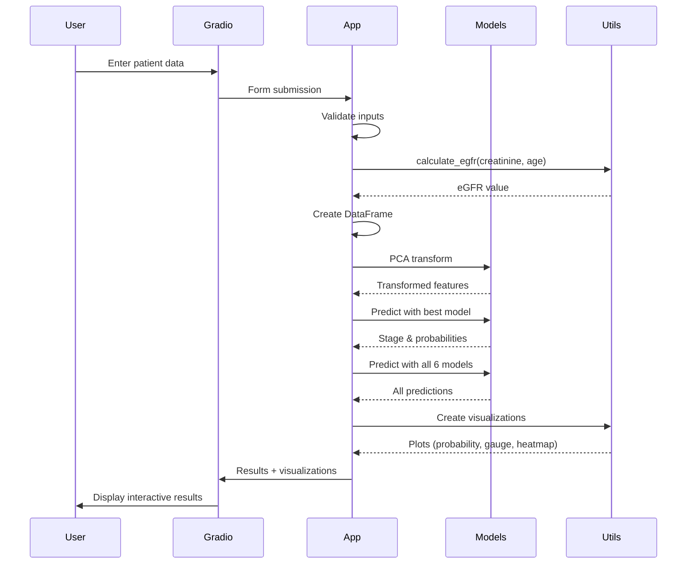

**Steps:**
1. User fills web form with 24 features
2. App validates and preprocesses inputs
3. Calculate eGFR from creatinine and age
4. Transform inputs using PCA pipeline
5. Get prediction from best model (Random Forest)
6. Get predictions from all 6 models
7. Generate 4 visualizations:
   - Stage probability distribution
   - eGFR gauge with zones
   - Model agreement heatmap
   - Comparison table
8. Display results with HTML formatting

---

### 3️⃣ **Data Flow Architecture**

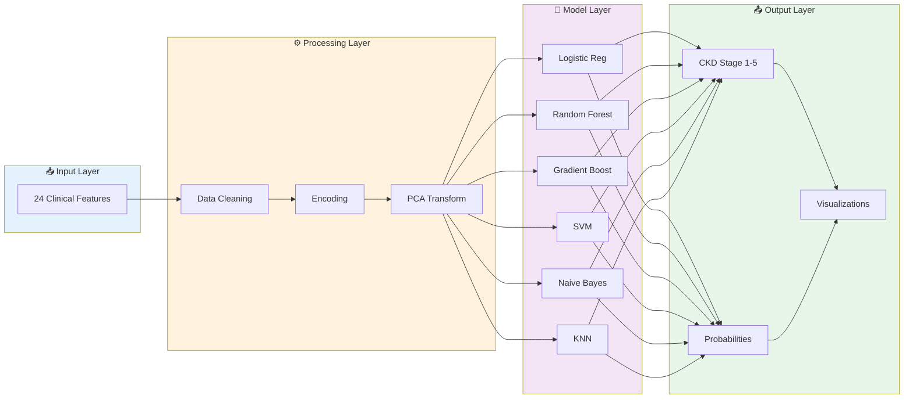

---

### 4️⃣ **System Architecture**

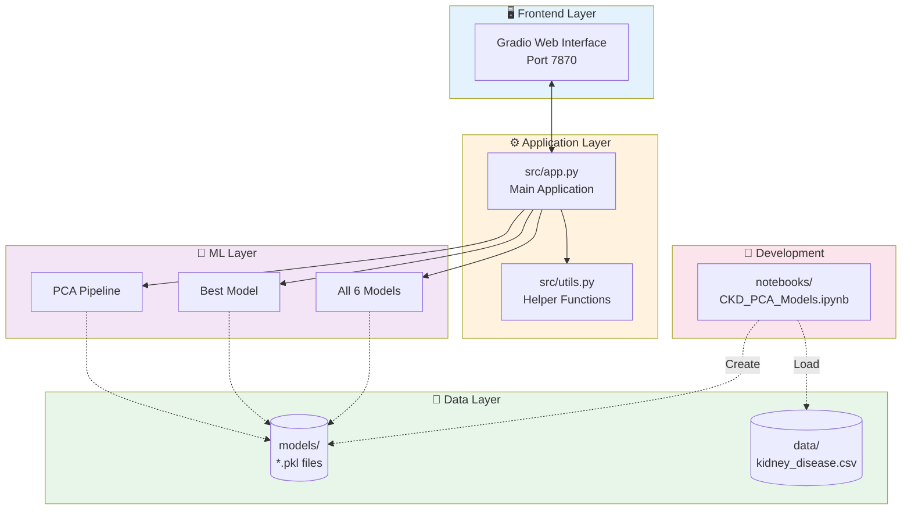

---

### 5️⃣ **eGFR Calculation Flow**

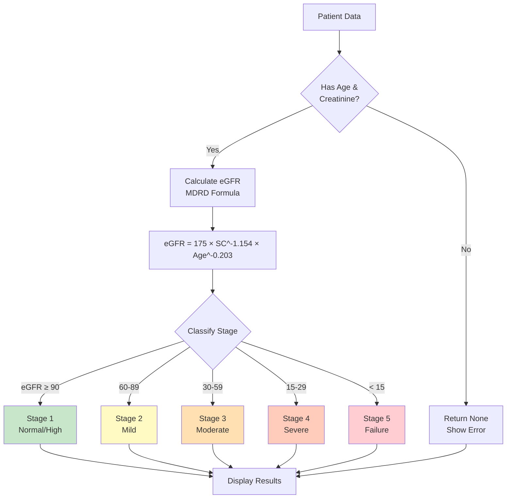

---

### 6️⃣ **Visualization Generation**

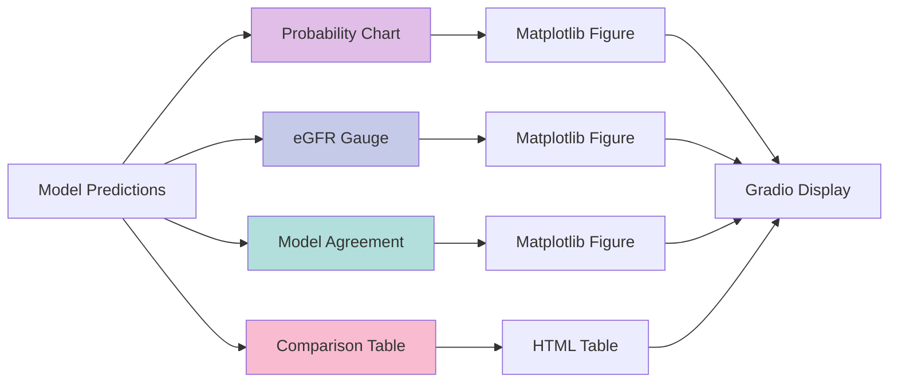

---

## 🔑 Key Technologies

| Component | Technology | Purpose |
|-----------|-----------|---------|
| **ML Framework** | scikit-learn 1.7.2 | Model training & prediction |
| **Dimensionality** | PCA | 24 → 20 features (95% variance) |
| **Web Interface** | Gradio 4.44.0 | Interactive UI |
| **Visualization** | Matplotlib 3.10.7 | Charts & plots |
| **Data Processing** | Pandas 2.3.3 | DataFrame operations |
| **Numerical** | NumPy 2.3.5 | Array operations |
| **Backend** | FastAPI 0.121.3 | API support |

---

## 📊 Model Ensemble Strategy

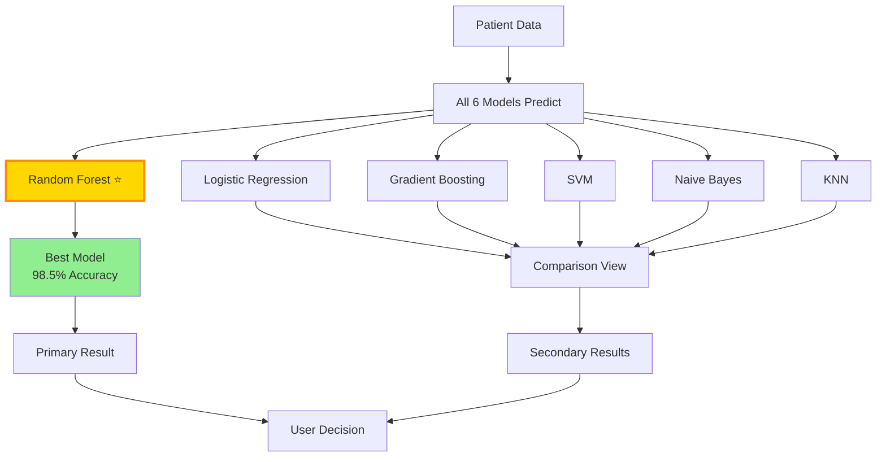

---

## 🎯 Use Case Flow

### Scenario: New Patient Evaluation

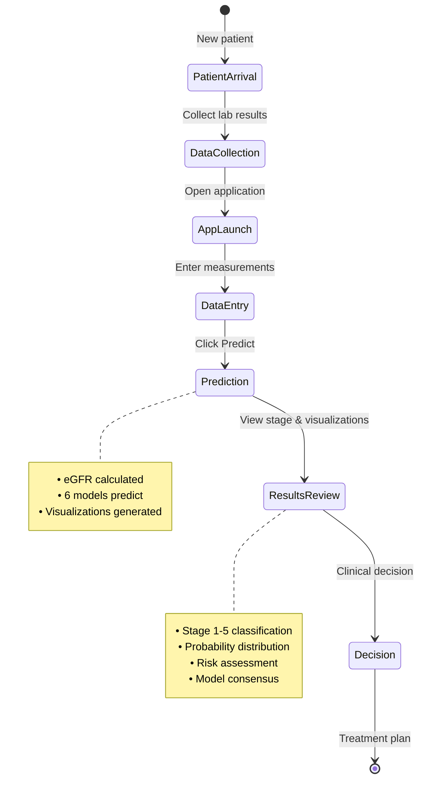

---

## 🔄 Development vs Production Flow

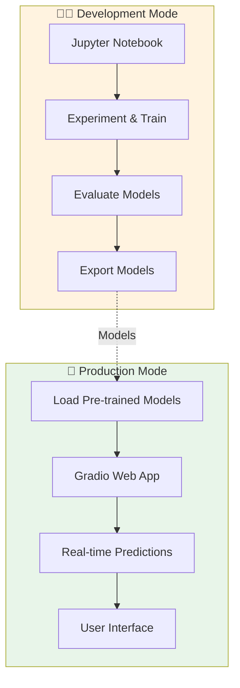

---

## 📁 File Flow

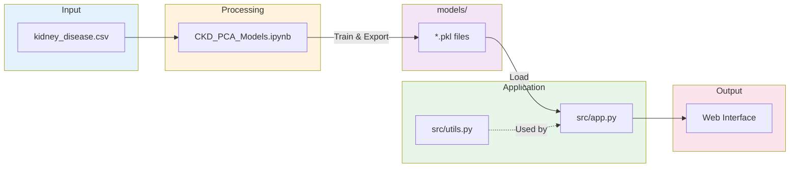

---

This flowchart document provides comprehensive visualization of:
- Complete system architecture
- Model training pipeline
- Prediction workflow
- Data flow
- Component interactions
- Use case scenarios

All diagrams use Mermaid syntax and will render beautifully in GitHub README!
